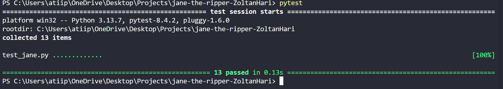

[](https://classroom.github.com/a/d_w3ds2H)
[](https://classroom.github.com/open-in-codespaces?assignment_repo_id=21360705)

# Jane the Ripper


## Requirements

- Python 3 or higher
- Git
- Pytest

## Installation

1. Clone the Repository
```bash
git clone https://github.com/WTCSC/jane-the-ripper-ZoltanHari
```
2. Open the Cloned Repository
```bash
cd jane-the-ripper-ZoltanHari
```
## Usage


## Usage Example


## Testing


## Testing Example



## Decision Tree 
